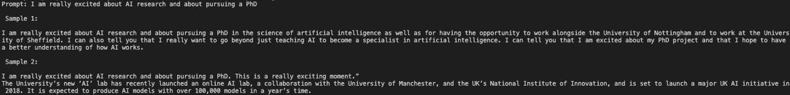
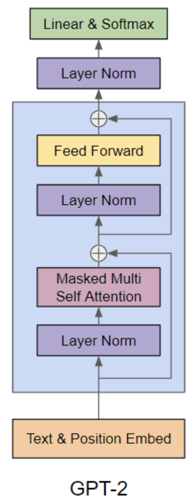
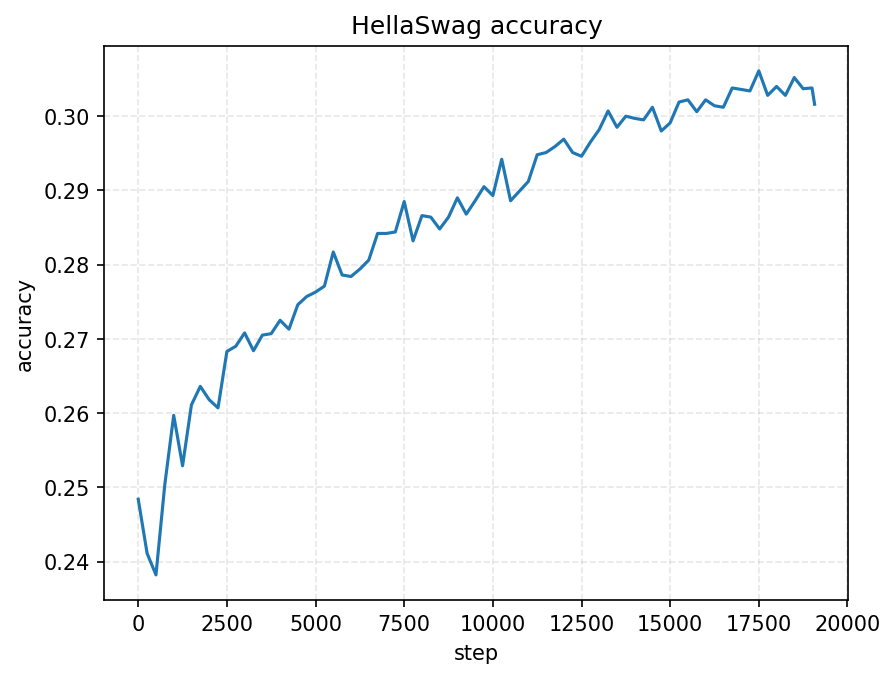
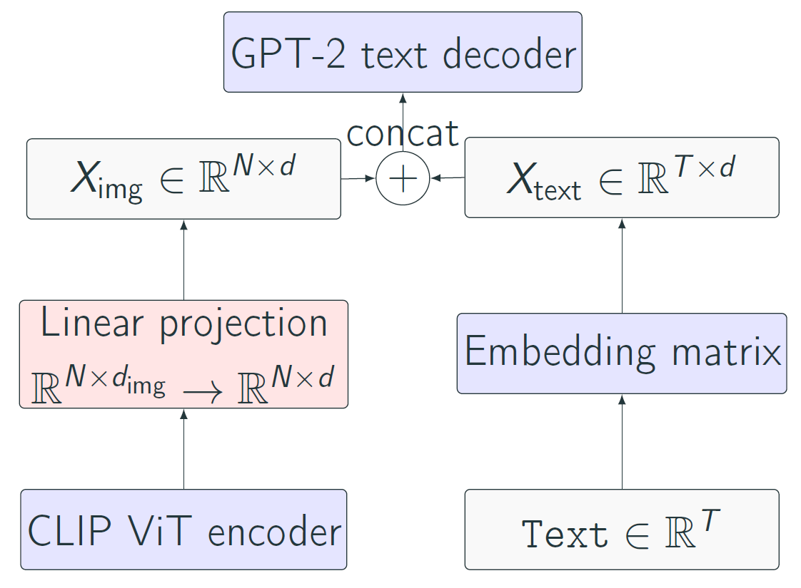
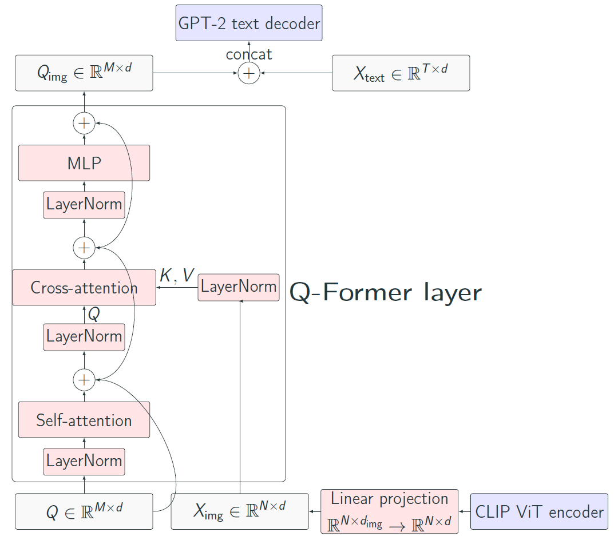

# gpt2-vision-language

  

    

## Introduction

We present in this repository an independent project that we developed in parallel with our Master 2 coursework.

The project has two main goals:

1. **Rebuild a GPT-2 decoder entirely from scratch** and pre-train it on a large-scale text corpus.  
2. **Adapt it to image captioning** by connecting a frozen vision encoder (CLIP ViT-L/14) to our frozen GPT-2 through lightweight multimodal bridges.

The motivation is to better understand large-scale pre-training, the difficulties of multimodal alignment, and to experiment with visual representations. We implemented everything ourselves: the model components, the architecture blocks, the training loop, and the optimization pipeline (except for the CLIP encoder, which we imported directly from Hugging Face). We conducted an exploratory study on image captioning, including a short literature review of multimodal LMs and a comparison of three **resource-efficient** architectures (illustrated below): **linear projection**, **cross-attention**, and **Q-Former-style blocks inspired by BLIP-2** [Li et al., 2023](#ref-blip2).

All experiments were run on **a single NVIDIA RTX A5000 GPU**.

We obtained the following results:  
— Built a **124M-parameter GPT-2 decoder**, following Andrej Karpathy’s 10-lecture series, trained it on **FineWeb-Edu (10B tokens)**, and reached **30% HellaSwag accuracy** after ~2 days on our GPU.  
— Fine-tuned the model on **COCO 2017** for image captioning; after **3 hours of training (1 epoch)** per architecture, the generated captions were already coherent with meaningful semantic content.  

More details about the architectures, results, and methods are provided below.

---

## High-Level Overview

### **Pre-training**

- Implemented a **124M-parameter GPT-2 decoder** from scratch, inspired by Andrej Karpathy’s 10-lecture “Zero to Hero” series.  
- Trained on **FineWeb-Edu (~10B tokens)**.  
- Used **FlashAttention** [Dao et al., 2022](#ref-flashattn), **mixed precision**, and **gradient accumulation** with a GPT-3-style effective batch size [Brown et al., 2020](#ref-gpt3).  
- Reached **≈30% accuracy on HellaSwag** after ~2 days of training on a single A5000 GPU.

### **Image captioning (COCO 2017)**

- Imported a **frozen CLIP ViT-L/14** encoder [Radford et al., 2021](#ref-clip).  
- Kept both CLIP and the GPT-2 decoder **frozen**, and trained only small bridging modules.  
- Compressed CLIP’s 257 tokens (1 [CLS] + 256 patch tokens) into a compact representation using **average pooling**.  
- Explored three lightweight multimodal bridges:  
  1. **Linear projection**  
  2. **Cross-attention layers**  
  3. **Q-Former-style blocks inspired by BLIP-2** [Li et al., 2023](#ref-blip2)  
- Fine-tuned on **MS-COCO 2017** [Chen et al., 2015](#ref-coco).  
- After **~3 hours** of training, the model already produced coherent and semantically aligned captions.

---

## Part 1 — GPT-2 From Scratch

Following Karpathy’s “Zero to Hero” series (https://karpathy.ai/), we reimplemented a 124M-parameter GPT-2 decoder from the ground up and trained it efficiently using FlashAttention [Dao et al., 2022](#ref-flashattn), mixed precision, and GPT-3-inspired hyperparameters [Brown et al., 2020](#ref-gpt3) with gradient accumulation.  
After two days of training on FineWeb-Edu (10B tokens), the model reached **30% HellaSwag accuracy**.

### Architecture

The decoder architecture mirrors the configuration from the original GPT-2 paper [Radford et al., 2019](#ref-gpt2).

  

### Hyperparameters

We reuse most architectural hyperparameters from GPT-2 [Radford et al., 2019](#ref-gpt2) and adopt the optimization setup from GPT-3 [Brown et al., 2020](#ref-gpt3):

- **Model size:** $12$ layers, $12$ attention heads, hidden size $768$ (GPT-2)  
- **Context length:** $1024$ tokens (GPT-2)  
- **Vocabulary:** Tiktoken tokenizer, $\approx 50\text{k}$ tokens  
- **Effective batch size:** $524{,}288$ tokens/step $= 16 \times 1024 \times 32$ (GPT-3)  
- **Optimizer:** AdamW with $\beta = (0.9,\ 0.95)$, weight decay $= 0.1$, gradient clipping $= 1$ (GPT-3)  
- **Learning-rate schedule:** cosine decay $(6\times10^{-4} \rightarrow 6\times10^{-5})$ (GPT-3), with 715 warmup steps

### Training curves

  
  

### Sample generations

  

---

## Part 2 — Multimodality

For the multimodal part, we imported **CLIP ViT-L/14** [Radford et al., 2021](#ref-clip), kept both CLIP and the GPT-2 decoder **frozen**, and trained only small bridging modules for image captioning.

For all three bridges, CLIP’s 257 embeddings (1 [CLS] + 256 patch embeddings) are reduced to 33 embeddings using **average pooling** for computational efficiency.

The three multimodal variants are all trained on **COCO 2017** [Chen et al., 2015](#ref-coco) (118k train, 5k val, 5 captions per image).

---

## Part 2.1 — Linear Projection Bridge

The simplest baseline uses a single linear layer that maps the pooled CLIP visual representation directly into the GPT-2 embedding space.

- **Architecture:**  
  Blocks highlighted in blue denote frozen parameters, whereas blocks in red correspond to trainable components.

  

    
  

- **Sample captions:**  

  

    
  

---

## Part 2.2 — Cross-Attention Bridge

In this variant, cross-attention layers are inserted inside the transformer blocks of the decoder. The new cross-attention modules attend to visual features, while all other parameters in the GPT-2 blocks remain frozen.

- **Architecture:**  
  Blue blocks are frozen; red blocks are trained.

  

    
  

- **Sample captions:**  

  

    
  

---

## Part 2.3 — Q-Former Bridge (Vision → Language)

The Q-Former-style bridge follows the idea of BLIP-2 [Li et al., 2023](#ref-blip2): a small transformer with learnable query tokens attends to frozen CLIP features and outputs a set of multimodal embeddings, which are then projected into the GPT-2 embedding space.

- **BLIP-2 reference architecture:**  

  

    
  

- **Architecture:**  
  Blue blocks are frozen; red blocks are trainable.

  

    
  

- **Sample captions:**  

  

    
  

---

## Part 2.4 — Results

Training for a single epoch (~3 hours) with AdamW and a cosine learning rate schedule results in stable validation loss curves across all three bridges.

### **Optimization**
For fine-tuning on COCO, we use the following optimization setup:

- **Micro-batch size:** $B = 128$ sequences  
- **Sequence length:** $T = 32$  
- **Gradient accumulation:** $1$ step (no accumulation)  
- **Optimizer:** AdamW with weight decay $0.1$ and gradient clipping at $1.0$  
- **Learning rate:** warmup over $40$ steps from $10^{-3}$ (≈ 5% of total steps), then cosine decay to $10^{-4}$  
- **Precision:** mixed precision (bfloat16 on GPU)

### **Validation loss comparison**

  

### **Captioning metrics (CIDEr, METEOR, etc.)**

| Model             | METEOR ↑        | CIDEr ↑   |
|-------------------|-----------------|-----------|
| Cross-Attention   | 0.334 ± 0.153   | 0.321     |
| Linear Projection | 0.379 ± 0.139   | 0.419     |
| **Q-Former**      | **0.412 ± 0.146** | **0.598** |

---

## Contributors 

This project is conducted by **[Gabriel Lenain](https://github.com/gabriellenain)**, **[Lucas Mebille](https://github.com/lucasmbll)**, and **[Théophile Laurent](https://github.com/theophile-lt)**.

## References

- Chen et al. (2015), *Microsoft COCO Captions*,  
  [arXiv:1504.00325](https://arxiv.org/abs/1504.00325)

- Radford et al. (2021), *Learning Transferable Visual Models From Natural Language Supervision* (CLIP),  
  [arXiv:2103.00020](https://arxiv.org/abs/2103.00020)

- Dao et al. (2022), *FlashAttention: Fast and Memory-Efficient Exact Attention with IO-Awareness*,  
  [arXiv:2205.14135](https://arxiv.org/abs/2205.14135)

- Li et al. (2023), *BLIP-2: Bootstrapping Language-Image Pre-training with Frozen Image Encoders and Large Language Models*,  
  [arXiv:2301.12597](https://arxiv.org/abs/2301.12597)

- Brown et al. (2020), *Language Models are Few-Shot Learners* (GPT-3),  
  [arXiv:2005.14165](https://arxiv.org/abs/2005.14165)

- Radford et al. (2019), *Language Models are Unsupervised Multitask Learners* (GPT-2),  
  [arXiv:1901.00502](https://arxiv.org/abs/1901.00502)

- Vedantam et al. (2015), *CIDEr: Consensus-based Image Description Evaluation*,  
  [arXiv:1411.5726](https://arxiv.org/abs/1411.5726)
