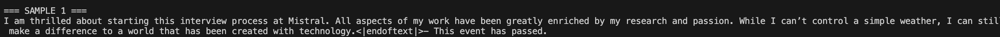
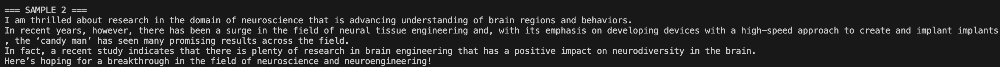
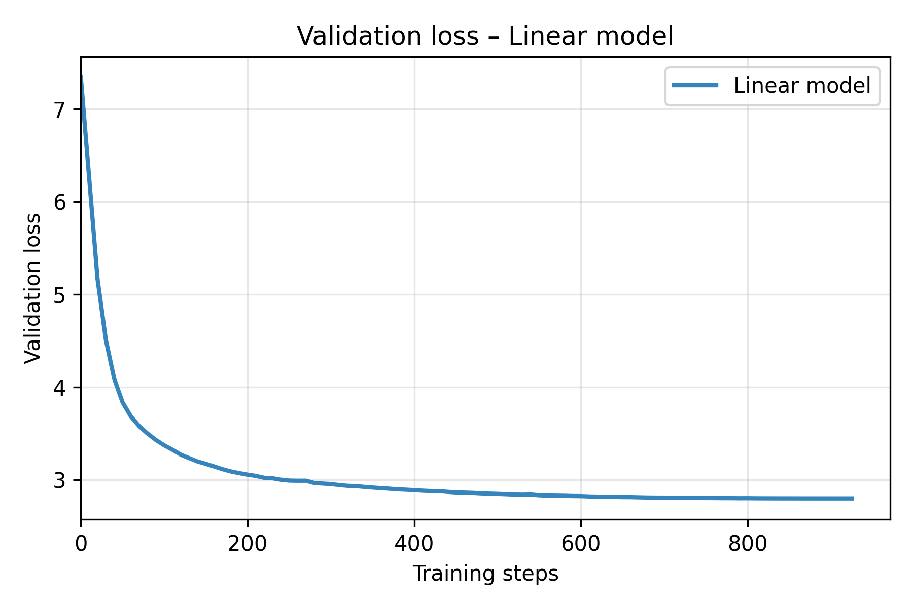
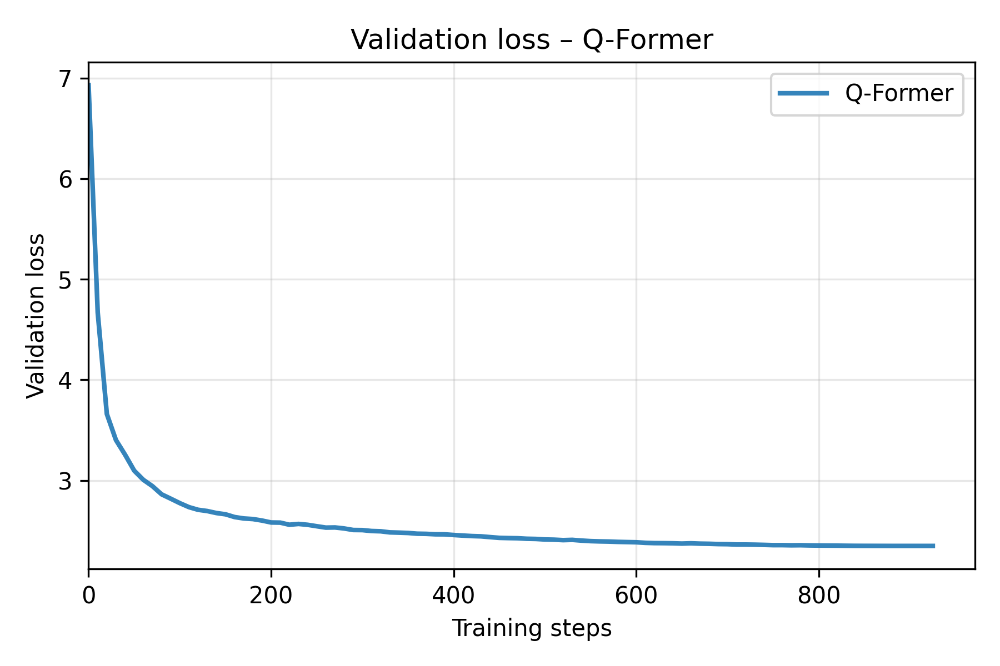

# gpt2-vision-language

## Introduction

We present in this repository an independent project that we developed in parallel with our IASD master coursework.

Our goals were:

1. **Build a GPT-2 decoder entirely from scratch** and pre-train it on a large corpus.  
2. **Fine-tune it for image captioning**, connecting a frozen vision encoder (CLIP ViT-L/14) to our frozen GPT-2 through several lightweight multimodal bridges.

We wanted to explore large-scale pre-training, understand the challenges of multimodal alignment, and experiment with vision representations. We implemented everything ourselves: model components, architecture blocks, and optimization logic. Exploration part in image-captioning task : literature review of multimodal language models, choice of three architectures few-resource-friendly (illustrated below): **linear projection**, **cross-attention**, and **Q-Former blocks inspired by BLIP-2**.

All experiments were run on **a single NVIDIA RTX A5000 GPU**.

We obtained the following results:  
— Built a **124M-parameter GPT-2 decoder**, following Andrej Karpathy’s 10-lecture series, trained it on **FineWeb-Edu (10B tokens)**, and reached **31% HellaSwag accuracy** after ~2 days on our GPU.  
— Fine-tuned the model on **COCO 2017** for image captioning; after only **3 hours of training (1 epoch)**, captions were already coherent with meaningful semantic content.  
More details are provided below.

Enjoyed a lot and we learned a lot… 

---

## High-Level Overview

### **Pre-training**
- Implemented a **124M-parameter GPT-2 decoder** from scratch, inspired by Karpathy’s 10-lecture series.  
- Trained on **FineWeb-Edu (~10B tokens)**.  
- Used **FlashAttention**, **mixed precision**, and **gradient accumulation** (GPT-3-style effective batch size).  
- Reached **≈31% accuracy on HellaSwag** after ~2 days of training on a single GPU.

  

### **Image captioning (COCO 2017)**
- Imported a **frozen CLIP ViT-L/14** encoder.  
- Kept both CLIP and GPT-2 **frozen**, training only small bridge modules.  
- Reduced CLIP’s 257 tokens (1 [CLS] + 256 patches) to a compact representation via **average pooling**.  
- Explored three lightweight architectures:
  1. **Linear projection**
  2. **Cross-attention layers**
  3. **Q-Former-style blocks inspired by BLIP-2**
- Fine-tuned on **MS-COCO 2017** (118k train, 5k val, 5 captions/image).  
- After **~3 hours**, the model already produced coherent and semantically aligned captions.

---

## Part 1 — GPT-2 From Scratch

Following Karpathy’s 10-lecture series, we reconstructed a 124M-parameter GPT-2 decoder entirely by hand and trained it efficiently using FlashAttention, mixed precision, and GPT-3-inspired hyperparameters with gradient accumulation.
After two days of training on FineWeb-Edu (10B tokens), the model achieved 31% HellaSwag accuracy, exceeding the performance of the original GPT-2 small on WebText-1B (à confirmer).  

### Architecture  
  

### Training curves  

### Sample generations  

---

## Part 2 — Multimodality

We imported **CLIP ViT-L/14**, kept both CLIP and GPT-2 **frozen**, and trained small bridging modules for image captioning.

For all three models, we reduced CLIP’s 257 embeddings (1 [CLS] + 256 patch embeddings) using **average pooling** for computational efficiency.

We then trained three architectures on **COCO 2017** (118k train, 5k val, 5 captions/image).

---

## Part 2.1 — Linear Projection Bridge

A single learned linear layer maps the pooled CLIP visual tokens directly into the GPT-2 embedding space.

- **Architecture:**  
  

- **Sample captions:**  
  

---

## Part 2.2 — Cross-Attention Bridge

Cross-attention layers are added inside the transformer blocks of the decoder, maintaining every parameters of other layers in the blocks frozen.

- **Architecture:**  
  

- **Sample captions:**  
  

---

## Part 2.3 — Q-Former Bridge (Vision → Language)

A set of learnable queries attends to frozen CLIP features, producing a compact set of multimodal embeddings projected into GPT-2’s embedding space.

- **BLIP-2 reference:**  
  

- **Architecture:**  
  

- **Sample captions:**  
  

---

## Part 2.4 — Results

A single epoch (~3 hours) with AdamW, cosine learning rate decay, and batch size adapted through gradient accumulation was sufficient for all three bridging models to converge to stable validation loss curves.

### **Validation loss comparison**  

### **Per-model validation curves**  
  
  

### **Captioning metrics (CIDEr, METEOR, etc.)**  
  

### **Additional figures**  
  

---
